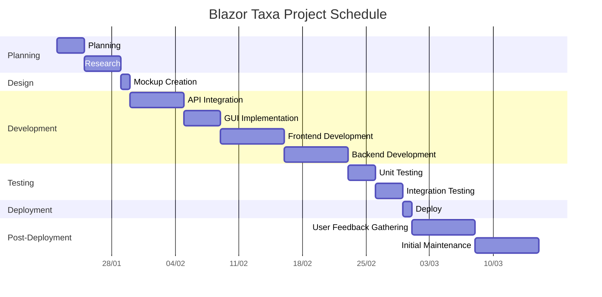

## Blazor Taxa Fare Calculator
This app calculates taxi fares from point A to B using Google API services. Built with Blazor on the .NET 8 framework, it offers a seamless experience for selecting taxi types and calculating trip costs.

### Features
* Interactive Map: Easily select your starting point and destination.
* Fare Calculation: Automatically calculates the fare based on distance and selected taxi type.
* Multiple Taxi Types: Choose from different types of taxis to fit your needs.
* User-Friendly Interface: Designed for ease of use on both desktop and mobile devices.

### Gantt diagram

